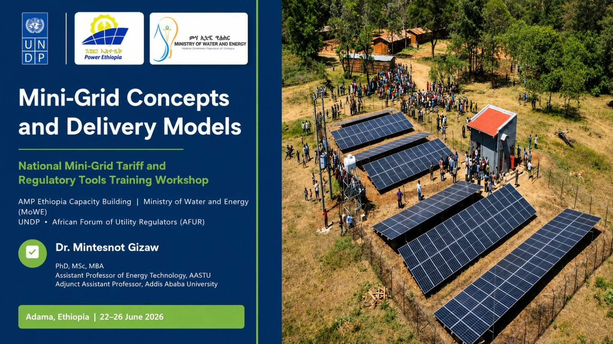
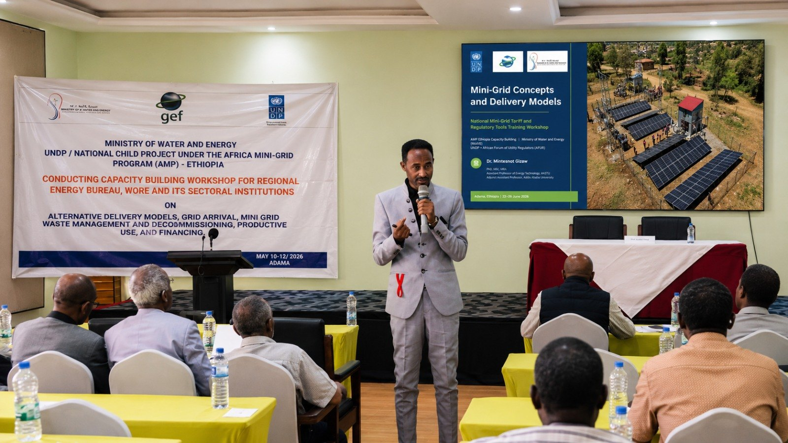

---

## Mini-grid training, tariff tools and regulatory capacity building

<table>
  <tr>
    <td width="50%">
      
    </td>
    <td width="50%">
      
    </td>
  </tr>
</table>

I served as a technical trainer and resource person for Adama mini-grid capacity-building workshops under Ethiopia’s Africa Mini-Grids Program, with participation from UNDP, GEF, the Ministry of Water and Energy, Power Ethiopia and related regional energy-sector institutions.

The training strengthened practical capacity in mini-grid concepts, delivery models, tariff tools, grid-arrival preparedness, productive use of renewable energy, financing, decommissioning and regulatory readiness.

**Selected training areas**

- Mini-grid fundamentals, delivery models, generation technologies, energy storage, power electronics and distribution architecture
- Renewable-energy resource assessment using Ethiopian solar, wind, hydro and hybrid-resource datasets
- Residential, institutional and productive-use load-demand analysis
- CAPEX/OPEX estimation, WACC calculation and cost-reflective tariff formulation
- Application of the AFUR Mini-Grid Tariff Tool for Ethiopian mini-grid scenarios
- Hybrid mini-grid modelling and scenario analysis using local case data
- Grid-arrival legal and technical provisions, including asset interconnection frameworks, licensing, tariff restructuring, service quality and grid-code compliance
- Metering, vending, interoperability, protection systems and fault dynamics for mini-grid operations
- Productive Use of Renewable Energy, cooperative business models, appliance financing and gender-transformative governance
- Pre-decommissioning planning, asset retirement obligations, end-of-life management, reverse logistics and circular-economy disposal pathways for mini-grid components

This work reflects my applied contribution to Ethiopia’s energy-access transition by linking technical design, tariff modelling, regulatory preparedness, productive-use business development, social inclusion and private-sector investment readiness.

[Related public event post](https://www.facebook.com/100001707184099/posts/27393468536960017/?app=fbl)
