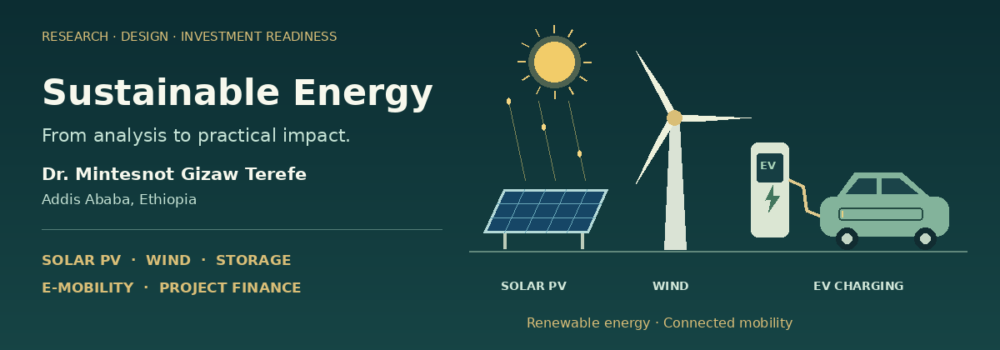

  

<h1 align="center">Dr. Mintesnot Gizaw Terefe</h1>

  <strong>Sustainable Energy Technology · Mini-Grids · Project Finance · Waste-to-Energy · E-Mobility</strong>

  <strong>PhD in Energy & Climate / Environmental Science</strong> · <strong>MBA in Industrial Management</strong> · <strong>MSc in Environmental Physics</strong>

  
  
  
  

  <strong>Addis Ababa, Ethiopia</strong> · Assistant Professor · Renewable Energy & Feasibility Consultant

I connect **energy-system design, applied research, feasibility studies and investment modelling** to support renewable-energy development in Ethiopia and across Africa.

My work spans **solar PV, hybrid mini-grids, battery storage, pumped-hydro storage, productive use of energy, waste-to-energy, bioenergy, EV charging infrastructure, climate-energy finance and bankable project development**.

---

## Featured portfolio

### Waste-to-Energy & Bioenergy Project Development, Africa

  <a href="https://peacelovewow4all-dot.github.io/">
    <strong>Explore my investor-facing Waste-to-Energy and Bioenergy portfolio</strong>
  </a>

This portfolio presents my work from **waste-stream screening** to **pre-feasibility, technical and commercial structuring, finance readiness and implementation support**. It includes experience related to **Reppie Waste-to-Energy**, feedstock intelligence, technology screening, household biogas, environmental safeguards and circular-energy project development.

---

## Africa Mini-Grids Program, AMP Ethiopia

  

  <a href="https://www.youtube.com/watch?v=ZvLq4KhAc2k">
    <strong>Watch AMP Ethiopia mini-grid capacity-building workshop evidence</strong>
  </a>

I served as a technical trainer and resource person for capacity-building workshops under the **Africa Mini-Grids Program, AMP Ethiopia**, with the participation of **UNDP, GEF, the Ministry of Water and Energy, Power Ethiopia and regional energy-sector institutions**.

The training focused on **mini-grid concepts and delivery models, tariff and regulatory tools, grid-arrival preparedness, productive use of renewable energy, waste management and decommissioning, and investment-oriented mini-grid planning for Ethiopia**.

### Core training contribution

- Mini-grid concepts, delivery models and hybrid system design
- Solar, wind, hydro and hybrid-resource assessment using Ethiopian datasets
- Productive-use, institutional and residential load-demand analysis
- CAPEX, OPEX, WACC and cost-reflective tariff formulation
- AFUR Mini-Grid Tariff Tool application for Ethiopian mini-grid scenarios
- Grid-arrival legal and technical provisions
- Decommissioning, circular economy and end-of-life asset management
- Productive Use of Renewable Energy, cooperative models and gender-transformative governance

<strong>View detailed AMP training contents delivered</strong>

### 1. Mini-grid concepts and delivery models

- Mini-grid fundamentals, including generation, storage, power electronics and distribution architecture
- Overview of solar PV, wind, hydro, diesel-backup and hybrid mini-grid generation technologies
- Energy-resource assessment using local datasets, including solar radiation, wind, hydro and other renewable resources
- Load-demand analysis for residential, institutional and productive-use electricity demand
- Cost modelling and technology design using CAPEX, OPEX, WACC and cost-reflective tariff logic
- Application of the AFUR Mini-Grid Tariff Tool for Ethiopian mini-grid scenarios
- Hybrid mini-grid modelling and scenario analysis using Ethiopian case data

### 2. Pre-decommissioning planning and finance

- Decommissioning-fund concepts and asset-retirement obligations
- Escrow-fund and reserve-planning logic for mini-grid asset retirement
- Trigger criteria for determining when to decommission, upgrade or extend asset life
- Asset-inventory mapping for PV modules, batteries, inverters, distribution assets and backup generators

### 3. Component-specific end-of-life management

- Battery energy storage system management, including safe discharge, logistics and recycling pathways
- PV-module testing, resale, reuse, dismantling and recovery of valuable materials
- Inverter and power-electronics handling, including printed-circuit boards, copper wiring and heavy metals
- Distribution-infrastructure recovery, including poles, transformers, cables and backup-generator residuals

### 4. Reverse logistics, circular economy and sustainable disposal

- Chain-of-custody documentation for hazardous and recyclable materials
- Remote-area logistics for off-grid and rural mini-grid sites
- Vendor take-back programs and extended producer responsibility
- Second-life applications for degraded mini-grid batteries
- Safe landfilling and disposal protocols for non-recyclable components
- Community handover and site-safety considerations after asset retirement

### 5. Grid-arrival technical and legal provisions

- Asset-interconnection frameworks and grid-arrival models
- Licensing and exemption amendments
- Tariff restructuring and subsidy legalities
- Liability, outages and service quality agreements
- Grid-code compliance and interconnection standards
- Power quality, parameter control, protection systems and fault dynamics
- Metering, vending and interoperability for mini-grid operations

### 6. Productive Use of Renewable Energy and cooperative business models

- Productive-use applications for rural energy access and enterprise development
- Cooperative ownership and governance models for mini-grid sustainability
- Appliance financing and business-management models
- Technical operations, safety and load management
- Regulatory, environmental and social-inclusion considerations

### 7. Gender-transformative approaches in mini-grid cooperative modalities

- Transforming mini-grid governance and ownership
- Reducing membership barriers for women and underserved groups
- Strengthening inclusive leadership and board governance
- Engaging men as allies in energy governance
- Linking productive-use activities with financial inclusion and household-level decision-making

  

---

## Research, projects and practical impact

### Hybrid renewable mini-grids

Research and design work on solar, wind, pumped-hydro storage, battery storage and energy-access systems for Ethiopian island and mainland communities.

### Renewable EV charging infrastructure

Developing a service-constrained optimisation framework for renewable-led fast-charging hubs along the **Addis Ababa–Hawassa corridor**, integrating PV, BESS, charger adequacy, reliability, costs, NPV, CFADS and DSCR.

### Project feasibility and finance

Techno-economic appraisal, financial modelling, bankability review, sensitivity analysis and lender-facing interpretation for renewable-energy and infrastructure projects.

### Waste-to-energy and bioenergy

Feedstock assessment, technology screening, circular-economy framing, household biogas experience and investment-oriented project development.

---

## Selected publications

- **2025 · Hybrid energy supply for Lake Ziway island**  
  [Cogent Engineering](https://doi.org/10.1080/23311916.2025.2468073)

- **2024 · Solar island with water-battery storage**  
  [Cogent Engineering](https://doi.org/10.1080/23311916.2024.2363001)

- **2023 · Wind, pumped-hydro and solar resource potential**  
  [EAI Endorsed Transactions on Energy Web](https://doi.org/10.4108/ew.88)

---

## Tools and analytical methods

**Energy systems:** HOMER Pro · PVsyst · PVGIS · GIS / ArcGIS · Terrain and resource assessment  
**Optimisation:** Python / MILP · MATLAB · Reliability and scenario analysis  
**Investment appraisal:** LCOE · NPV · IRR · WACC · CFADS · DSCR · CAPEX / OPEX  
**Project development:** Feasibility studies · Bankability review · ESG and safeguards · Productive-use business models

---

## Professional learning and online training

- **UNDP SDG Finance Academy**: Introduction to Sustainable Finance for Climate and Energy, completed with **100% final score**
- **Eco-Justice Africa Workshop**
- **Politecnico di Milano**: Strategic Energy Planning and Industrial Ecology
- **Politecnico di Milano**: Sustainable Business in the Renewable Energy Sector
- **Politecnico di Milano**: Life Cycle and Project Planning
- **Politecnico di Milano**: Fundamentals of Financial and Management Accounting
- **Politecnico di Milano**: Project Management Beyond Planning and Control
- **ICTP**: Solar Energy and Energy Storage Technologies
- **UNIDO**: Low-Carbon Clean Energy Technology Transfer

---

## Collaboration

I welcome collaboration on:

- Bankable renewable-energy feasibility studies
- Solar PV, BESS, mini-grid and productive-use projects
- EV charging infrastructure planning and optimisation
- Renewable-energy project finance and lender-facing modelling
- Waste-to-energy, biomass and bioenergy project development
- Energy-access and climate-resilient infrastructure
- Energy and climate research, postgraduate supervision and capacity building
- Africa-focused sustainable-finance and energy-transition initiatives

  <a href="mailto:mintesnot.gizaw@aastu.edu.et">
    <strong>Contact me by email</strong>
  </a>
  ·
  <a href="https://peacelovewow4all-dot.github.io/">
    <strong>View portfolio</strong>
  </a>
  ·
  <a href="https://scholar.google.com/citations?user=a-nB_U0AAAAJ&hl=en">
    <strong>Google Scholar</strong>
  </a>

---

<strong>Explore full experience, education and additional professional details</strong>

## Current roles

- **Assistant Professor of Sustainable Energy Technology**, Addis Ababa Science and Technology University, AASTU
- **Adjunct Assistant Professor**, Center for Environmental Science, Addis Ababa University
- **Renewable Energy and Feasibility Consultant**, Power Ethiopia and independent assignments
- Academic and professional engagement spanning renewable energy, project development, climate-energy systems, environmental management and capacity building

## Education

- **PhD, Energy & Climate / Environmental Science**, Addis Ababa University, Ethiopia, 2024, with international research engagement at the **University of Padova, Italy**
- **MBA, Industrial Management**, Addis Ababa Science and Technology University, Ethiopia, 2017
- **MSc, Environmental Physics**, Haramaya University, Ethiopia, 2012
- **BSc, Applied Physics**, Arba Minch University, Ethiopia, 2008
- Executive and continuing education in **Strategic Energy Planning and Industrial Ecology**, Politecnico di Milano, Italy

## Core expertise

`Renewable Energy` · `Solar PV` · `Mini-Grids` · `Battery Storage` · `Pumped-Hydro Storage` · `Energy Access` · `E-Mobility`  
`Feasibility Studies` · `Techno-Economic Modelling` · `Project Finance` · `NPV / IRR / DSCR / CFADS / WACC / LCOE`  
`PVsyst` · `PVGIS` · `HOMER Pro` · `Python / MILP` · `MATLAB` · `GIS / ArcGIS` · `LiDAR / DEM`  
`Waste-to-Energy` · `Bioenergy` · `Productive Use of Energy` · `Climate & ESG` · `Environmental Safeguards`

## Selected renewable-energy and feasibility work

### Solar-powered productive-use and public-service systems

Experience includes feasibility and modelling contributions for solar-powered irrigation, multi-town water supply, remote public services and off-grid mini-grid applications in Ethiopia.

### Standalone solar PV and mini-grid bankability review

Reviewed and replicated financial-model logic for standalone solar PV systems, including energy-yield interpretation, battery replacement implications, debt tenor, CFADS, DSCR, project and equity returns, sensitivity analysis and investment-readiness flags.

### IOM Mozambique technical contribution

Technical contributor to **Market Dialogue I: Empowering Displaced Communities Through Energy Mesh Networks**, supporting discussion around decentralized renewable-energy access and community mesh-grid concepts for displaced communities in Mozambique.

## International research, training and collaboration

- **University of Padova, Italy**: international research engagement / Coimbra Group Visiting Scholar, Department of Industrial Engineering
- **Politecnico di Milano, Department of Energy**: Strategic Energy Planning and Industrial Ecology for Local Sustainable and Just Development
- **ICTP**: Solar Energy and Energy Storage Technologies
- **UNIDO**: Low-Carbon Clean Energy Technology Transfer
- International academic networking and cooperation development in sustainable energy and higher education

## Teaching, mentoring and capacity building

I teach and supervise undergraduate and postgraduate work in sustainable energy, environmental systems, energy and climate, renewable-energy applications, modelling, feasibility analysis and related project development.

My capacity-building experience includes renewable-energy and productive-use training designed for **600+ entrepreneurs**, alongside student supervision and professional training for energy-sector stakeholders.

## Media: technical and scientific analysis

- https://www.youtube.com/watch?v=dt4updLdym8
- https://www.youtube.com/watch?v=ZvLq4KhAc2k
- https://www.youtube.com/watch?v=G3ZK0-3nrQo

